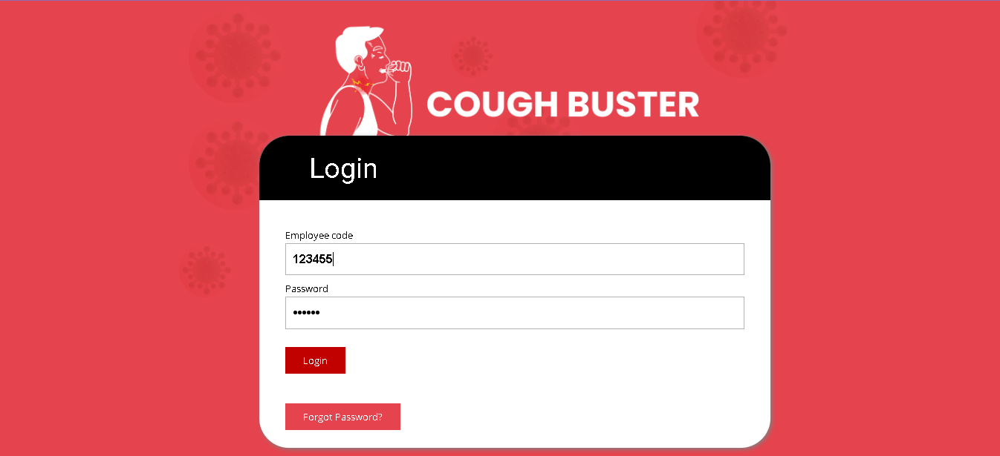
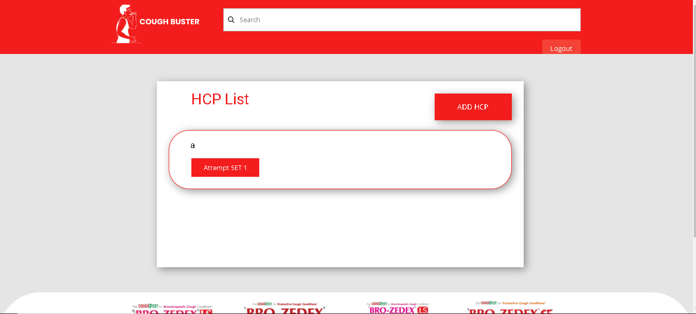
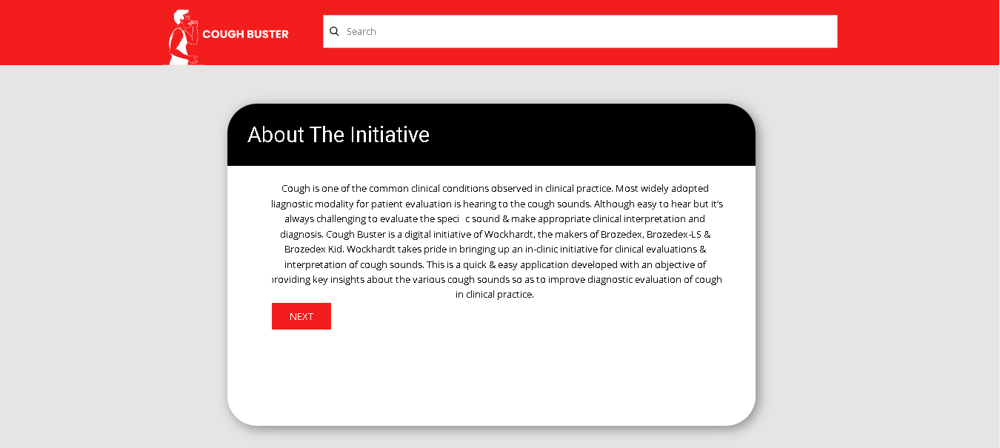
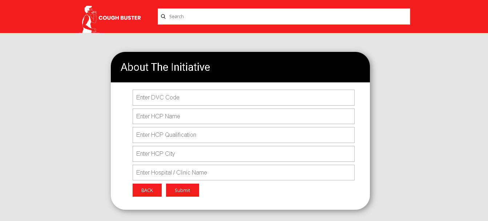
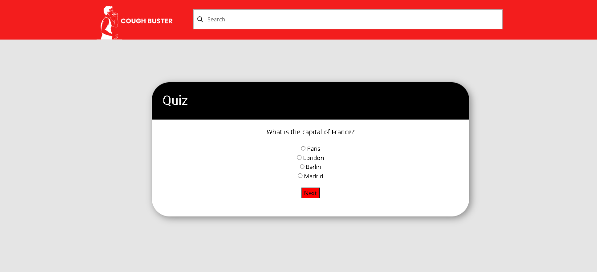
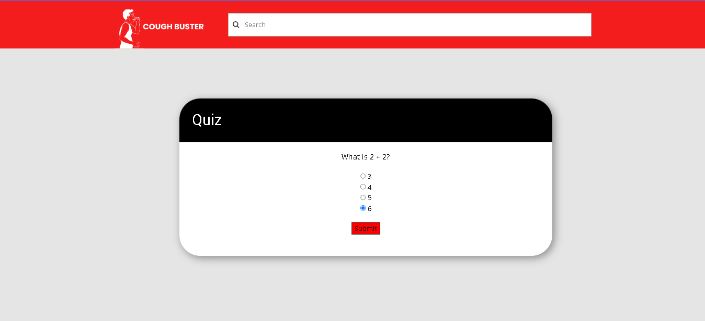
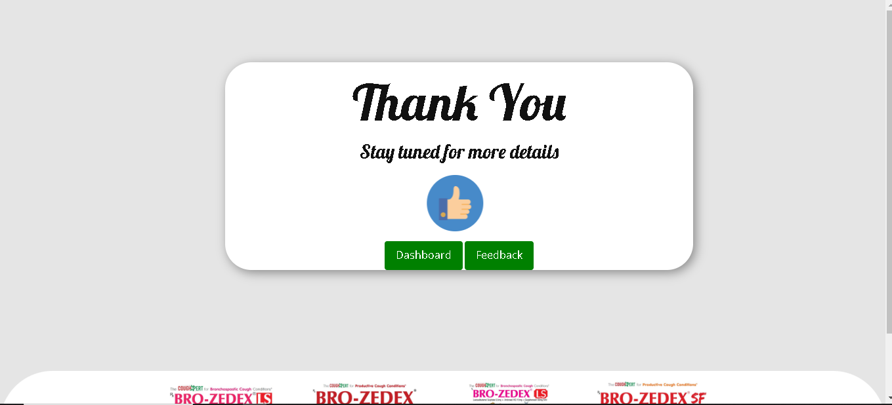

# CoughBuster

CoughBuster is a comprehensive web application designed to facilitate the registration and engagement of healthcare professionals (HCPs) in educational events. The application allows multiple Medical Representatives (MRs) to log in, register HCPs, conduct quizzes, and provide immediate feedback on quiz responses.











## Table of Contents

- [Features](#features)
- [Installation](#installation)
- [Usage](#usage)
- [Technologies Used](#technologies-used)
- [Contributing](#contributing)
- [License](#license)
- [Contact](#contact)

## Features

- **MR Authentication**: MRs can log in using their unique employee code and password.
- **Dashboard**: Upon successful login, MRs are redirected to a dashboard page.
- **HCP Registration**: MRs can register new HCPs through a registration form.
- **Quiz Functionality**: After registration, HCPs are redirected to a quiz page where they can answer event-related questions.
- **Real-time Feedback**: Immediate feedback is provided for each quiz question, indicating whether the answer is correct or incorrect.
- **Thank You Page**: After completing the quiz, HCPs are redirected to a thank you page.

## Installation

1. **Clone the repository**:
    ```bash
    git clone https://github.com/your-username/CoughBuster.git
    ```

2. **Navigate to the project directory**:
    ```bash
    cd CoughBuster
    ```

3. **Install dependencies**:
    ```bash
    composer install
    npm install
    ```

4. **Set up environment variables**:
    - Copy the `.env.example` file to `.env`:
        ```bash
        cp .env.example .env
        ```
    - Update the `.env` file with your database and other configuration details.

5. **Run database migrations**:
    ```bash
    php artisan migrate
    ```

6. **Start the development server**:
    ```bash
    php artisan serve
    npm run dev
    ```

## Usage

1. **Log in**:
    - MRs can log in using their employee code and password.

2. **Access the Dashboard**:
    - After logging in, MRs will be redirected to the dashboard.

3. **Register HCPs**:
    - Use the registration form on the dashboard to add new HCPs.

4. **Take the Quiz**:
    - After registering, HCPs will be redirected to the quiz page to answer event-related questions.
    - Immediate feedback will be provided for each question.

5. **Thank You Page**:
    - Upon completing the quiz, HCPs will be redirected to a thank you page.

## Technologies Used

- **Backend**: Laravel
- **Frontend**: Blade templates, JavaScript, CSS
- **Database**: MySQL
- **Authentication**: Laravel Auth

## Contributing

Contributions are welcome! Please follow these steps to contribute:

1. Fork the repository.
2. Create a new branch:
    ```bash
    git checkout -b feature/your-feature-name
    ```
3. Commit your changes:
    ```bash
    git commit -m 'Add some feature'
    ```
4. Push to the branch:
    ```bash
    git push origin feature/your-feature-name
    ```
5. Open a pull request.

## License

This project is licensed under the MIT License. See the [LICENSE](LICENSE) file for details.

## Contact

For any inquiries or feedback, please contact Ujwal Umesh Dangi at [ujwaldangi335789@gmail.com](mailto:ujwaldangi335789@gmail.com).

---

Thank you for using CoughBuster! We hope it helps you streamline the process of engaging healthcare professionals in your educational events.
